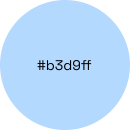
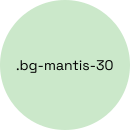

<section class="intro-section">
  

    The OpenAQ Design System provides a structured and reusable approach to
    building consistent and accessible user interfaces. It includes foundational
    elements like color, typography, and icons, as well as interactive
    components such as buttons, inputs, cards, and badges. You can navigate the
    design system by using the menu to the left or click the shortcuts below.
  

  <h2>Shortcuts</h2>
  

    <a href="/overview/color#overviewColorHeading" class="type-link-1 shortcut-link">  Copy hex code</a>
    <a href="/overview/color#variablesHeading" class="type-link-1 shortcut-link"> Variables</a>
    <a href="/utilities/colors#full-color-palette" class="type-link-1 shortcut-link"> Color classes</a>
  

</section>
